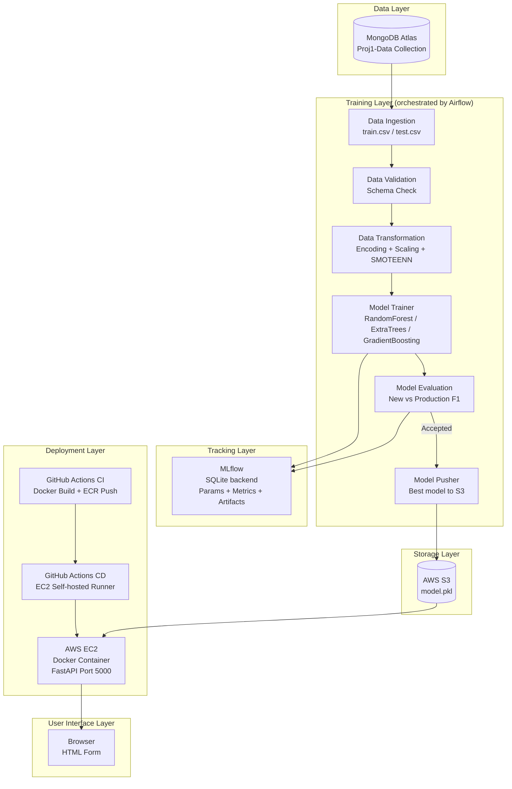
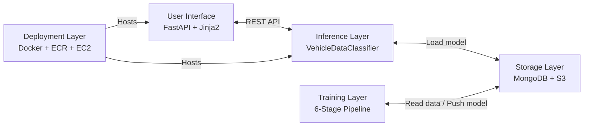
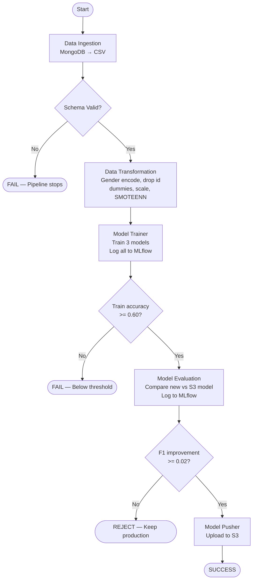
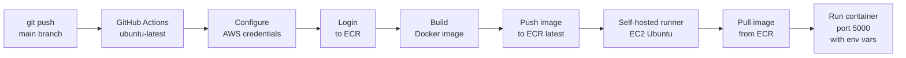
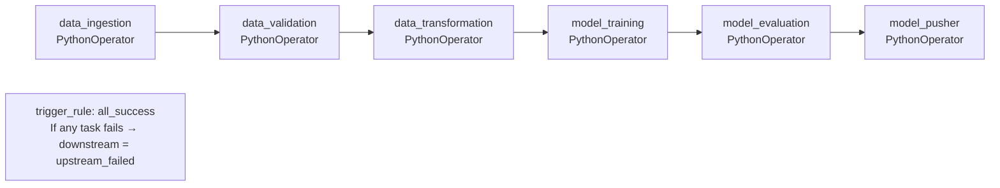
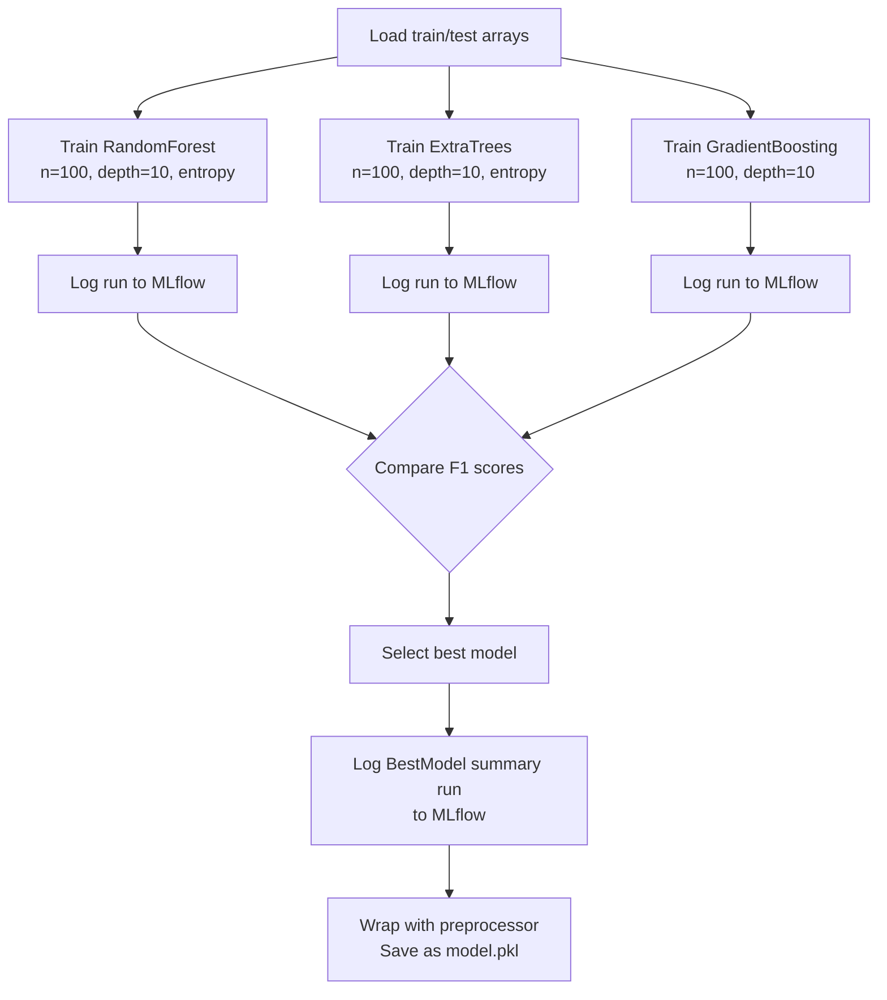

# High-Level Design (HLD) Document
## DA5402 MLOps Final Project — Vehicle Insurance Cross-Sell Prediction

**Author:** Ganesh Mula | **Course:** DA5402, IIT Madras | **Version:** 1.0

---

## 1. System Overview

End-to-end MLOps system predicting vehicle insurance cross-sell interest. Covers data ingestion, training pipeline, experiment tracking, CI/CD deployment, and real-time inference.

---

## 2. High-Level Architecture

---

## 3. Five-Layer Architecture

---

## 4. Training Pipeline Flow

---

## 5. CI/CD Pipeline

---

## 6. Airflow DAG Structure

---

## 7. Model Selection Logic

---

## 8. Technology Rationale

| Choice | Rationale |
|---|---|
| MongoDB Atlas | Cloud-native, flexible schema, easy bulk insert |
| RandomForest / ExtraTrees / GradientBoosting | All sklearn, no new dependencies, diverse ensemble approaches |
| SMOTEENN | Combined oversampling + cleaning — best for this imbalanced dataset |
| dill | Handles complex Python objects sklearn Pipeline can't serialize with pickle |
| MLflow SQLite | Reliable rendering in MLflow 3.x UI vs file-based mlruns |
| Airflow | Industry-standard pipeline orchestration with visual DAG |
| FastAPI | Async, high performance, auto OpenAPI docs |
| Docker + ECR + EC2 | Full reproducibility from dev to production |

---

## 9. Design Principles

**Loose Coupling:** Frontend ↔ Backend via REST only. Each pipeline stage independent.

**Single Responsibility:** One class per pipeline stage. Config/Artifact dataclasses separate concerns.

**Fail Fast:** `MyException` captures filename + line number. Airflow stops pipeline on any task failure.

**Reproducibility:** All hyperparameters in `constants/__init__.py`. MLflow logs every run. Docker ensures identical runtime.

---

## 10. Limitations & Future Work

| Limitation | Proposed Solution |
|---|---|
| No DVC data versioning | Integrate DVC with S3 remote |
| No Prometheus/Grafana | Add /metrics endpoint + Grafana dashboard |
| No docker-compose | Separate frontend/backend as two services |
| No unit tests | Add pytest per component |
| Manual trigger only | Schedule Airflow DAG with cron |
