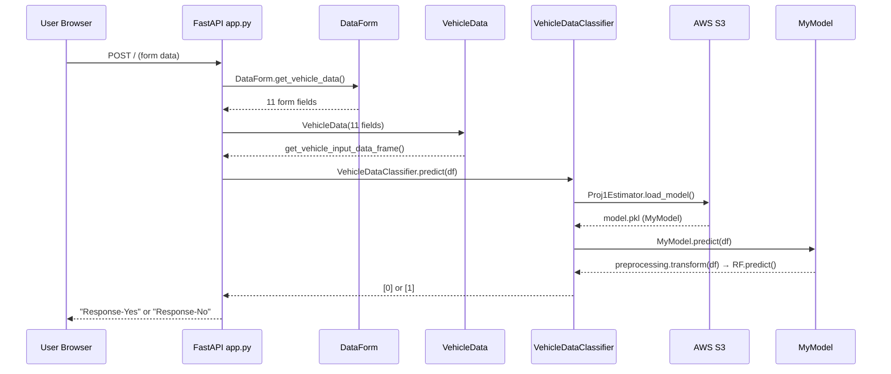
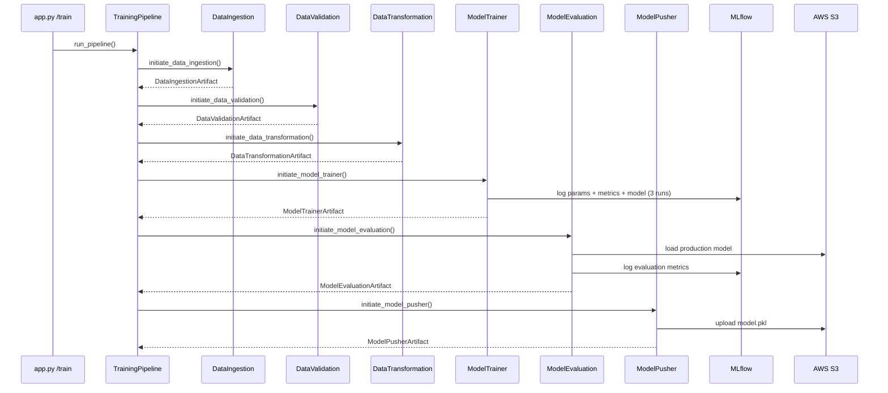
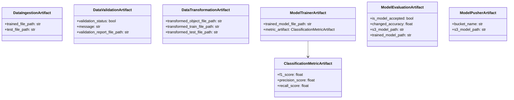

# Low-Level Design (LLD) Document
## DA5402 MLOps Final Project — Vehicle Insurance Cross-Sell Prediction

**Author:** Ganesh Mula | **Course:** DA5402, IIT Madras | **Version:** 1.0

---

## 1. API Endpoint Definitions

### 1.1 GET /

```
Method  : GET
URL     : /
Auth    : None
Body    : None
Response: 200 OK — text/html — Renders vehicledata.html
```

### 1.2 POST /

```
Method        : POST
URL           : /
Content-Type  : application/x-www-form-urlencoded
```

**Input fields:**

| Field | Type | Valid Values |
|---|---|---|
| Gender | int | 0 = Female, 1 = Male |
| Age | int | 18–85 |
| Driving_License | int | 0 = No, 1 = Yes |
| Region_Code | float | 0.0–52.0 |
| Previously_Insured | int | 0 = No, 1 = Yes |
| Annual_Premium | float | > 0 |
| Policy_Sales_Channel | float | 1.0–163.0 |
| Vintage | int | 10–299 |
| Vehicle_Age_lt_1_Year | int | 0 or 1 |
| Vehicle_Age_gt_2_Years | int | 0 or 1 |
| Vehicle_Damage_Yes | int | 0 or 1 |

**Response (Success):** `200 OK` — `text/html` — context = `"Response-Yes"` or `"Response-No"`

**Response (Error):** `200 OK` — `application/json` — `{"status": false, "error": "..."}`

### 1.3 GET /train

```
Method       : GET
URL          : /train
Required Env : MONGODB_URL, AWS_ACCESS_KEY_ID, AWS_SECRET_ACCESS_KEY
Response OK  : 200 — "Training successful!!!"
Response Err : 200 — "Error Occurred! <message>"
```

---

## 2. Prediction Request Flow



---

## 3. Training Pipeline Flow



---

## 4. Class-Level Design

### MyModel
```
Attributes:
  preprocessing_object : sklearn.Pipeline
    ColumnTransformer:
      StandardScaler  → [Age, Vintage]
      MinMaxScaler    → [Annual_Premium]
      passthrough     → remaining columns

  trained_model_object : best of (RandomForest, ExtraTrees, GradientBoosting)

predict(df: DataFrame) -> ndarray:
  Step 1: transformed = preprocessing_object.transform(df)
  Step 2: return trained_model_object.predict(transformed)
```

### DataTransformation sequence
```
_map_gender_column()      Female → 0, Male → 1
_drop_id_column()         drops [id, _id] per schema.yaml
_create_dummy_columns()   pd.get_dummies(drop_first=True)
_rename_columns()         Vehicle_Age_< 1 Year → Vehicle_Age_lt_1_Year
get_data_transformer_object() → sklearn Pipeline (ColumnTransformer)
SMOTEENN(sampling_strategy="minority") applied post-transform
```

### ModelTrainer — 3-model comparison
```
Candidate models:
  RandomForest:     n=100, depth=10, criterion=entropy, rs=101
  ExtraTrees:       n=100, depth=10, criterion=entropy, rs=101
  GradientBoosting: n=100, depth=10, rs=101

For each model:
  1. fit(x_train, y_train)
  2. evaluate on x_test → accuracy, f1, precision, recall
  3. mlflow.start_run(run_name=model_name)
     log_params(model_type, n_estimators, max_depth, ...)
     log_metrics(accuracy, f1_score, precision, recall)
     log_model(model, model_name)

Select: best_model = argmax(f1) across 3 models
Log:    BestModel_<name> summary run to MLflow
Save:   MyModel(preprocessor + best_model) → model.pkl
```

---

## 5. Artifact Dataclasses



---

## 6. Key Configuration Constants

```
APP_HOST = 0.0.0.0                  APP_PORT = 5000
DATABASE_NAME = Proj1               COLLECTION = Proj1-Data
TARGET_COLUMN = Response            SPLIT_RATIO = 0.25

MODEL_TRAINER_N_ESTIMATORS = 200    (full run; 100 used in 3-model compare)
MAX_DEPTH = 10                      CRITERION = entropy
MIN_SAMPLES_SPLIT = 7               MIN_SAMPLES_LEAF = 6
RANDOM_STATE = 101                  EXPECTED_SCORE = 0.60
EVAL_THRESHOLD = 0.02

MODEL_BUCKET = my-model-mlops-final-proj-628409561482-ap-south-2-an
REGION = ap-south-2
MLFLOW_TRACKING_URI = sqlite:///mlflow.db
MLFLOW_EXPERIMENT = VehicleInsurance
```

---

## 7. Schema Validation Rules

```
Required columns  : 12
  id, Gender, Age, Driving_License, Region_Code, Previously_Insured,
  Vehicle_Age, Vehicle_Damage, Annual_Premium, Policy_Sales_Channel,
  Vintage, Response

Numerical columns : Age, Driving_License, Region_Code, Previously_Insured,
                    Annual_Premium, Policy_Sales_Channel, Vintage, Response
Categorical cols  : Gender, Vehicle_Age, Vehicle_Damage
Drop columns      : [id, _id]
StandardScaler    : [Age, Vintage]
MinMaxScaler      : [Annual_Premium]
```

---

## 8. File System Layout

```
artifact/MM_DD_YYYY_HH_MM_SS/
├── data_ingestion/
│   ├── feature_store/data.csv
│   └── ingested/
│       ├── train.csv
│       └── test.csv
├── data_validation/
│   └── report.yaml
├── data_transformation/
│   ├── transformed/
│   │   ├── train.npy
│   │   └── test.npy
│   └── transformed_object/
│       └── preprocessing.pkl
└── model_trainer/
    └── trained_model/
        └── model.pkl
```

---

## 9. Logging & Exception Handling

**Logger:** `src/logger/__init__.py`
- RotatingFileHandler: 5MB max, 3 backups
- Format: `[ timestamp ] name - level - message`
- Console handler: INFO level

**MyException:** `src/exception/__init__.py`
- Captures: filename, line number, error message
- All components wrap logic in try/except → re-raise MyException
- Full traceback chain visible in logs
