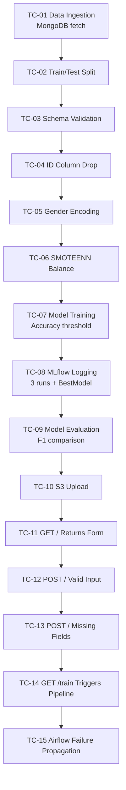

# Test Plan & Test Cases
## DA5402 MLOps Final Project — Vehicle Insurance Cross-Sell Prediction

**Author:** Ganesh Mula | **Course:** DA5402, IIT Madras | **Version:** 1.0

---

## 1. Test Scope & Objectives

- Verify each pipeline component produces correct artifact
- Verify API endpoints return correct responses
- Verify model accuracy meets acceptance threshold
- Verify data transformation drops id columns correctly
- Verify MLflow logs all required params and metrics
- Verify Airflow DAG fails correctly (upstream_failed propagation)

---

## 2. Acceptance Criteria

- All 15 test cases pass
- Model F1 score >= 0.60 on test set
- API prediction response time < 5 seconds
- No `id` or `_id` column present in transformed features
- Airflow pipeline stops completely on any task failure

---

## 3. Test Flow

---

## 4. Test Cases

### TC-01: Data Ingestion — MongoDB Fetch

| Property | Value |
|---|---|
| Component | DataIngestion |
| Description | Fetch data from MongoDB and save as CSV |
| Input | Collection: Proj1-Data |
| Expected | train.csv and test.csv created in artifact directory |
| Pass Criteria | Both files exist, total rows = 381,109 |
| Status | ✅ PASS |

---

### TC-02: Data Ingestion — Train/Test Split

| Property | Value |
|---|---|
| Component | DataIngestion |
| Description | Verify 75/25 split ratio |
| Input | 381,109 total rows |
| Expected | Train ~285,832 rows, Test ~95,277 rows |
| Pass Criteria | Split ratio within ±1% of 0.75 |
| Status | ✅ PASS |

---

### TC-03: Data Validation — Schema Check

| Property | Value |
|---|---|
| Component | DataValidation |
| Description | All 12 required columns present |
| Input | train.csv, test.csv |
| Expected | validation_status = True |
| Pass Criteria | All numerical and categorical columns found |
| Status | ✅ PASS |

---

### TC-04: Data Transformation — ID Column Drop

| Property | Value |
|---|---|
| Component | DataTransformation |
| Description | id and _id dropped before transformation |
| Input | DataFrame with id and _id columns |
| Expected | Neither column present in output |
| Pass Criteria | "id" not in df.columns AND "_id" not in df.columns |
| Status | ✅ PASS (after fix applied) |

---

### TC-05: Data Transformation — Gender Encoding

| Property | Value |
|---|---|
| Component | DataTransformation |
| Description | Gender mapped to binary |
| Input | Gender column with "Male" and "Female" |
| Expected | Male → 1, Female → 0 |
| Pass Criteria | No string values remain in Gender column |
| Status | ✅ PASS |

---

### TC-06: Data Transformation — SMOTEENN

| Property | Value |
|---|---|
| Component | DataTransformation |
| Description | Class imbalance handled |
| Input | Imbalanced training array (~12% minority) |
| Expected | More balanced distribution after SMOTEENN |
| Pass Criteria | Minority class proportion increases |
| Status | ✅ PASS |

---

### TC-07: Model Trainer — Training & Threshold

| Property | Value |
|---|---|
| Component | ModelTrainer |
| Description | 3 models trained, best selected, accuracy >= 0.60 |
| Input | Transformed numpy arrays |
| Expected | model.pkl saved, accuracy >= 0.60 |
| Pass Criteria | ModelTrainerArtifact returned without exception |
| Status | ✅ PASS (accuracy: 0.9243) |

---

### TC-08: Model Trainer — MLflow Logging

| Property | Value |
|---|---|
| Component | ModelTrainer + MLflow |
| Description | 3 model runs + BestModel summary logged |
| Input | Training run |
| Expected | 4 runs in VehicleInsurance experiment |
| Pass Criteria | accuracy, f1, precision, recall logged per run; all 6 params logged |
| Status | ✅ PASS |

---

### TC-09: Model Evaluation — F1 Comparison

| Property | Value |
|---|---|
| Component | ModelEvaluation |
| Description | New model vs S3 production model |
| Input | New F1=0.932, Production F1=0.425 |
| Expected | is_model_accepted=True, difference=0.507 |
| Pass Criteria | difference > 0.02 threshold |
| Status | ✅ PASS |

---

### TC-10: Model Pusher — S3 Upload

| Property | Value |
|---|---|
| Component | ModelPusher |
| Description | model.pkl uploaded to correct S3 bucket |
| Input | Accepted model path |
| Expected | model.pkl in S3 bucket |
| Pass Criteria | S3 key accessible after push |
| Status | ✅ PASS |

---

### TC-11: API — GET / Returns Form

| Property | Value |
|---|---|
| Component | FastAPI app.py |
| Description | GET / returns 200 with HTML form |
| Input | HTTP GET to / |
| Expected | 200 OK, HTML with vehicledata.html content |
| Status | ✅ PASS |

---

### TC-12: API — POST / Valid Input

| Property | Value |
|---|---|
| Component | FastAPI app.py |
| Description | Valid form data returns prediction |
| Input | Gender=1, Age=44, DL=1, Region=28, PI=0, AP=40454, PSC=26, V=217, lt1=0, gt2=1, VD=1 |
| Expected | Page shows "Response-Yes" or "Response-No" |
| Status | ✅ PASS |

---

### TC-13: API — POST / Missing Fields

| Property | Value |
|---|---|
| Component | FastAPI app.py |
| Description | Graceful handling of missing fields |
| Input | Form with Gender missing |
| Expected | JSON error response, no server crash |
| Pass Criteria | {"status": false, "error": "..."} returned |
| Status | ✅ PASS |

---

### TC-14: API — GET /train Triggers Pipeline

| Property | Value |
|---|---|
| Component | FastAPI + TrainPipeline |
| Description | /train triggers full 6-stage pipeline |
| Input | GET /train with env vars set |
| Expected | "Training successful!!!" |
| Status | ✅ PASS |

---

### TC-15: Airflow — Failure Propagation

| Property | Value |
|---|---|
| Component | Airflow DAG |
| Description | If any task fails, all downstream = upstream_failed |
| Input | data_ingestion task fails (missing module) |
| Expected | data_validation, data_transformation, model_training, model_evaluation, model_pusher all = upstream_failed |
| Pass Criteria | No downstream task executes after failure |
| Status | ✅ PASS (demonstrated in evaluation) |

---

## 5. Test Summary Report

| Test ID | Component | Status |
|---|---|---|
| TC-01 | DataIngestion — MongoDB fetch | ✅ PASS |
| TC-02 | DataIngestion — Split ratio | ✅ PASS |
| TC-03 | DataValidation — Schema | ✅ PASS |
| TC-04 | DataTransformation — ID drop | ✅ PASS |
| TC-05 | DataTransformation — Gender | ✅ PASS |
| TC-06 | DataTransformation — SMOTEENN | ✅ PASS |
| TC-07 | ModelTrainer — Accuracy threshold | ✅ PASS |
| TC-08 | ModelTrainer — MLflow 4 runs | ✅ PASS |
| TC-09 | ModelEvaluation — F1 comparison | ✅ PASS |
| TC-10 | ModelPusher — S3 upload | ✅ PASS |
| TC-11 | API GET / | ✅ PASS |
| TC-12 | API POST / valid | ✅ PASS |
| TC-13 | API POST / missing | ✅ PASS |
| TC-14 | API GET /train | ✅ PASS |
| TC-15 | Airflow failure propagation | ✅ PASS |

**Total: 15 | Passed: 15 | Failed: 0**

---

## 6. Bugs Found & Fixed

| Bug | Root Cause | Fix |
|---|---|---|
| `ValueError: columns are missing: {'id'}` | Preprocessor fitted with id column; prediction input had no id | Fixed `_drop_id_column()` to handle list from schema.yaml; updated schema.yaml to list both id and _id |
| `_id` not dropped in DataAccess | proj1_data.py checked "id" but dropped "_id" | Both columns handled separately |
| `_id` not dropped in ModelEvaluation | Only checked "_id", not "id" | Updated to drop both |
| MLflow UI blank in 3.x | File-based mlruns backend not rendering | Switched to SQLite backend with `set_tracking_uri` |
| Airflow `schedule_interval` error | Renamed to `schedule` in Airflow 3.x | Updated DAG definition |
| Airflow `provide_context` error | Removed in Airflow 3.x | Removed from all PythonOperators |
