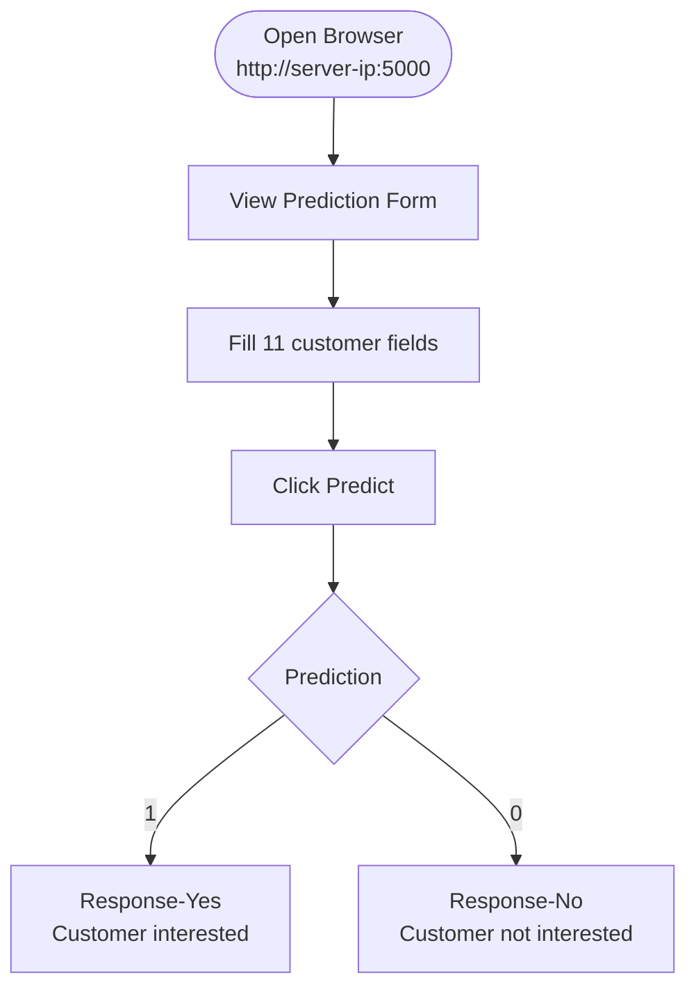

# User Manual
## Vehicle Insurance Cross-Sell Prediction App
### DA5402 MLOps Final Project

**For non-technical users**

---

## What Does This App Do?

This app predicts whether a health insurance customer is likely to be interested in vehicle insurance. Enter basic customer details and the app instantly returns a prediction.

---

## How to Access

Open your web browser and go to:
```
http://<server-ip>:5000
```

---

## Step-by-Step Guide

### Step 1 — Fill in the form

| Field | What to enter | Example |
|---|---|---|
| Gender | 0 = Female, 1 = Male | 1 |
| Age | Customer age in years | 35 |
| Driving License | 1 = Has license, 0 = No | 1 |
| Region Code | Region number (0–52) | 28 |
| Previously Insured | 1 = Already has vehicle insurance, 0 = No | 0 |
| Annual Premium | Annual health insurance amount paid | 40000 |
| Policy Sales Channel | Channel code (1–163) | 26 |
| Vintage | Days with the company | 217 |
| Vehicle Age < 1 Year | 1 = Vehicle is less than 1 year old | 0 |
| Vehicle Age > 2 Years | 1 = Vehicle is more than 2 years old | 1 |
| Vehicle Damage | 1 = Vehicle was damaged before, 0 = No | 1 |

### Step 2 — Click Predict

### Step 3 — Read the result

- **Response-Yes** → Customer is likely interested in vehicle insurance
- **Response-No** → Customer is likely NOT interested

---

## App Navigation



---

## Common Questions

**What if I enter wrong values?**
The app shows an error. Go back and check all fields are filled with numbers.

**How accurate is the prediction?**
The model achieves 92.4% accuracy and 93.2% F1 score on test data.

**Can I use this for multiple customers?**
Yes — submit once per customer. Each submission is independent.

---

## For Administrators Only

### Trigger Model Retraining
```
http://<server-ip>:5000/train
```
This pulls fresh data, trains 3 models, selects the best, and pushes to production. Takes ~10-15 minutes.

### View Experiment History (MLflow)
```bash
mlflow ui --port 5001 --backend-store-uri sqlite:///mlflow.db
# Open http://127.0.0.1:5001
```

### View Pipeline Runs (Airflow)
```bash
# WSL2 Ubuntu terminal
airflow standalone
# Open http://localhost:8080
```

---

## Troubleshooting

| Problem | Solution |
|---|---|
| Page doesn't load | Check server IP and port 5000 is open |
| Error after submitting | Ensure all 11 fields are filled with valid numbers |
| Training fails | Check MONGODB_URL and AWS credentials are set |
| MLflow UI is blank | Run from project root directory |
| Airflow DAG not visible | Check dags/ folder is in AIRFLOW_HOME |
