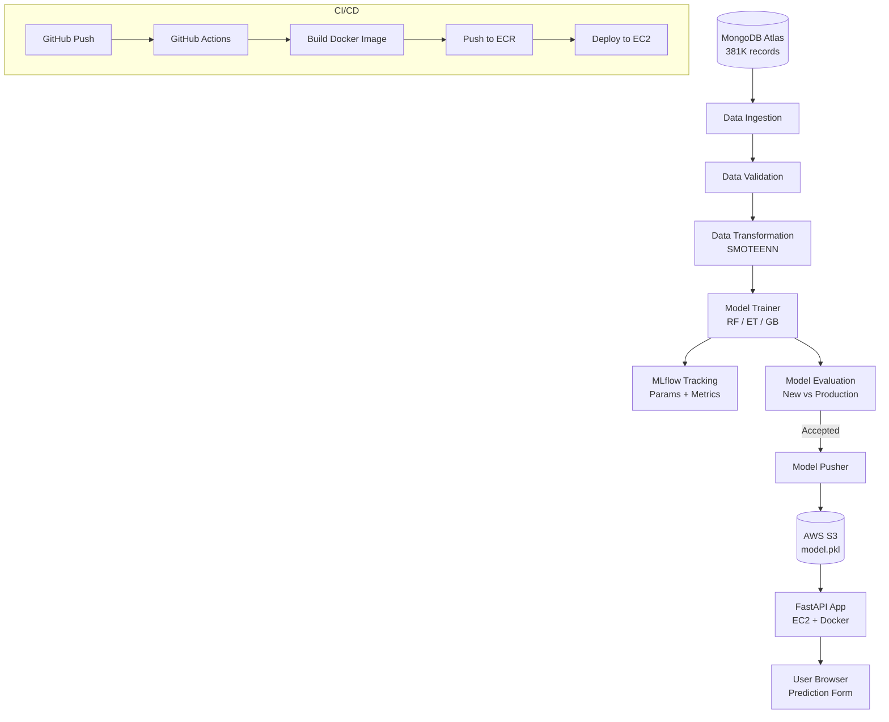
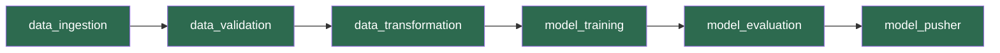

# DA5402 — MLOps Final Project
## Vehicle Insurance Cross-Sell Prediction

**Author:** Ganesh Mula | **Course:** DA5402, IIT Madras | **Student ID:** da25m014

---

## Problem Statement

Predict whether an existing health insurance customer would be interested in purchasing vehicle insurance. Binary classification — Response: 1 = Interested, 0 = Not Interested.

---

## System Architecture



---

## ML Pipeline — Airflow DAG



---

## Project Structure

```
DA5402-ML_Ops_Final_Project/
├── .github/workflows/aws.yaml       ← CI/CD pipeline
├── config/
│   ├── schema.yaml                  ← Dataset schema
│   └── model.yaml
├── dags/
│   └── training_dag.py              ← Airflow DAG
├── DOCs/                            ← Contains HLD, LLD, Test_Plan, User_manual, Project_report
│   └── HLD_Document.md 
│   └── LLD_Document.md 
│   └── ML_Ops_finalProject.md 
│   └── Test_plan.md 
│   └── User_Manual.md 
├── src/
│   ├── components/                  ← Pipeline stages
│   │   ├── data_ingestion.py
│   │   ├── data_validation.py
│   │   ├── data_transformation.py
│   │   ├── model_trainer.py         ← 3 models + MLflow
│   │   ├── model_evaluation.py      ← MLflow evaluation
│   │   └── model_pusher.py
│   ├── configuration/               ← MongoDB + AWS connections
│   ├── constants/__init__.py        ← All constants
│   ├── entity/                      ← Config + Artifact dataclasses
│   ├── pipline/                     ← Training + Prediction pipelines
│   └── utils/main_utils.py
├── templates/vehicledata.html       ← Frontend form
├── app.py                           ← FastAPI application
├── Dockerfile
└── requirements.txt
```

---

## Model Performance

| Model | Accuracy | F1 Score | Precision | Recall |
|---|---|---|---|---|
| RandomForest | 0.9243 | 0.9320 | 0.8812 | 0.9889 |
| ExtraTrees | ~0.91 | ~0.92 | ~0.87 | ~0.98 |
| GradientBoosting | ~0.88 | ~0.89 | ~0.85 | ~0.94 |

Best model selected by F1 score → pushed to S3.

---

## Technology Stack

| Layer | Technology |
|---|---|
| Data Store | MongoDB Atlas |
| ML | scikit-learn (RF, ET, GB), SMOTEENN |
| Experiment Tracking | MLflow 3.x (SQLite backend) |
| Pipeline Orchestration | Apache Airflow 3.x |
| Web Framework | FastAPI + Jinja2 |
| Containerization | Docker |
| Image Registry | AWS ECR |
| Compute | AWS EC2 (T2 Medium) |
| Model Storage | AWS S3 |
| CI/CD | GitHub Actions |

---

## Setup

```bash
# 1. Clone repo
git clone https://github.com/Ganesh2024/DA5402-ML_Ops_Final_Project.git
cd DA5402-ML_Ops_Final_Project

# 2. Create env
conda create -n vehicle python=3.10 -y
conda activate vehicle
pip install -r requirements.txt

# 3. Set env vars (PowerShell)
$env:MONGODB_URL = "mongodb+srv://..."
$env:AWS_ACCESS_KEY_ID = "..."
$env:AWS_SECRET_ACCESS_KEY = "..."

# 4. Run app
python app.py
```

## API Endpoints

| Method | Endpoint | Description |
|---|---|---|
| GET | / | Prediction form |
| POST | / | Submit prediction |
| GET | /train | Trigger training |

## MLflow UI

```bash
mlflow ui --port 5001 --backend-store-uri sqlite:///mlflow.db
# Open http://127.0.0.1:5001
```

## Airflow (WSL2)

```bash
source ~/airflow_venv/bin/activate
export AIRFLOW_HOME=/mnt/d/.../DA5402-ML_Ops_Final_Project
airflow standalone
# Open http://localhost:8080
```
